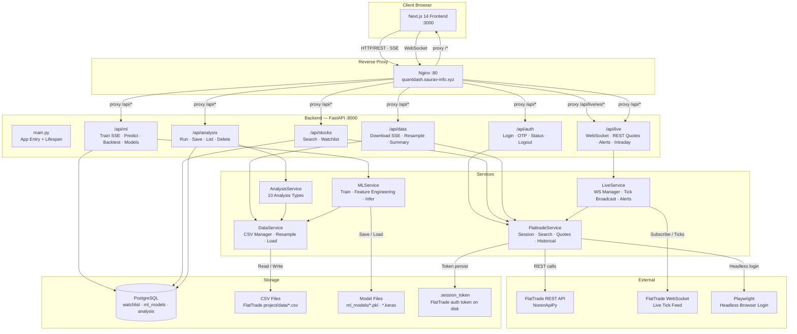
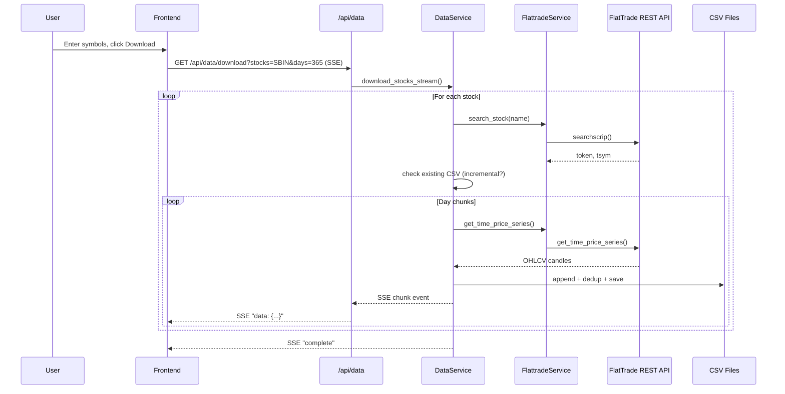
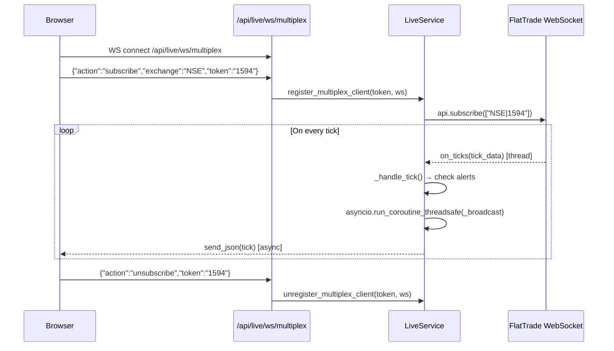

# High Level Design — Subaru QuantDash

## 1. System Overview

Subaru QuantDash is a personal stock market intelligence dashboard for Indian equity markets (NSE/BSE). It connects to the FlatTrade broker API to download historical OHLCV data, stream live tick data, run technical analysis, train and backtest ML prediction models, and display everything in a Next.js frontend. The system is deployed on a single Linux host behind an Nginx reverse proxy, accessible at `quantdash.saurav-info.xyz`.

---

## 2. Architecture Diagram



---

## 3. Component Descriptions

### 3.1 Next.js Frontend (`frontend/`)
- **What it is**: Next.js 14 (App Router) SPA, TypeScript, React 18
- **Responsibility**: All user-facing UI — login flow, watchlist, data management, charting (Recharts), analysis dashboards, ML training/prediction, live tick display and alerts
- **Key interfaces**: Consumes all `/api/*` REST endpoints + SSE streams + `/api/live/ws/` WebSockets
- **State management**: Zustand (`lib/store.ts`) for auth state; component-local state elsewhere
- **API client**: Axios (`lib/api.ts`) with a shared base URL `/api`
- **Pages**: `login`, `stocks`, `data`, `analysis`, `analysis/compare`, `live`, `live/alerts`, `ml/train`, `ml/models`

### 3.2 Nginx Reverse Proxy (`nginx.conf`)
- **What it is**: Nginx HTTP server on port 80
- **Responsibility**: Routes all traffic — `/api/live/ws/*` → FastAPI (with WebSocket upgrade headers), `/api/*` → FastAPI (buffering off for SSE), `/*` → Next.js
- **Key settings**: 600s proxy timeout for SSE streams (data download, ML training), 3600s for WebSockets, `proxy_buffering off` to support Server-Sent Events

### 3.3 FastAPI Backend (`backend/main.py`)
- **What it is**: FastAPI 0.109+ on uvicorn, async, Python 3.12
- **Responsibility**: HTTP/WebSocket server, request logging middleware, CORS, startup/shutdown lifecycle (DB init, session restore, background token refresh)
- **Background tasks**: Daily 05:00 IST token re-validation via `asyncio.create_task`
- **Routers**: 6 routers, all under `/api` prefix

### 3.4 FlattradeService (`services/flattrade.py`)
- **What it is**: Singleton bridge to the FlatTrade broker API
- **Responsibility**: Headless Playwright login with OTP interception, session token management (persist to `.session_token` file), stock search (with ranked results), REST quote fetching, historical time-price-series fetching
- **OTP mechanism**: Monkey-patches `builtins.input` in a background thread so the login flow blocks at OTP prompt until the API receives the code
- **Location**: `backend/services/flattrade.py`

### 3.5 LiveService (`services/live_service.py`)
- **What it is**: Singleton WebSocket hub
- **Responsibility**: Manages one FlatTrade WebSocket connection in a background thread; maintains a registry of frontend WebSocket clients per symbol token; broadcasts ticks; checks price alerts on every tick
- **Thread bridge**: Uses `asyncio.run_coroutine_threadsafe` to push tick data from the FlatTrade thread into the FastAPI async event loop
- **Features**: Per-token subscription/unsubscribe, multiplex WebSocket (one connection, multiple symbols), last-tick cache for new subscribers, in-memory price alerts
- **Location**: `backend/services/live_service.py`

### 3.6 DataService (`services/data_service.py`)
- **What it is**: CSV data manager
- **Responsibility**: Downloads historical OHLCV data from FlatTrade in day-chunks with incremental update support, saves to CSV; resamples 1-minute base data to any interval on demand (with caching); provides `load_for_analysis` for other services
- **Storage**: CSVs in `FlatTrade_API-ReadyToUse/data/` — e.g., `SBIN-EQ.csv`, `SBIN-EQ_5min.csv`
- **Progress**: Generator yielding SSE-formatted JSON strings, streamed to frontend
- **Location**: `backend/services/data_service.py`

### 3.7 AnalysisService (`services/analysis_service.py`)
- **What it is**: Technical analysis engine
- **Responsibility**: Runs up to 10 analysis types on loaded CSV data; returns chart-ready JSON for Recharts
- **Analysis types**: `price`, `returns`, `volatility`, `technicals` (SMA/EMA/MACD/RSI/BB/ATR), `volume`, `patterns` (hour/DOW heatmaps), `drawdown`, `seasonality`, `momentum` (ROC), `riskreturn` (Sharpe/Sortino/VaR)
- **Modes**: Single-symbol and multi-symbol comparison (normalized prices + correlation + beta)
- **Location**: `backend/services/analysis_service.py`

### 3.8 MLService (`services/ml_service.py`)
- **What it is**: ML training and inference engine
- **Responsibility**: Feature engineering (30+ features — price, momentum, volatility, time), model training with progress streaming via SSE, model persistence (`.pkl` / `.keras`), inference for regression and classification tasks
- **Supported models**: Linear Regression, Ridge, Lasso, SVM, Random Forest (scikit-learn), XGBoost, LightGBM, LSTM (TensorFlow/Keras)
- **Location**: `backend/services/ml_service.py`

### 3.9 PostgreSQL Database
- **Tables**:
  - `watchlist` — saved symbols with token, exchange, company name
  - `ml_models` — trained model metadata: type, features, hyperparams, metrics, feature importance, file path, training date range
  - `analysis` — saved analysis results (config + result summary)
- **Access**: SQLAlchemy 2.0 async engine, asyncpg driver, connection pool (size=10, overflow=20), per-request sessions via FastAPI dependency injection

---

## 4. Data Flows

### 4.1 Historical Data Download



### 4.2 Live Tick Streaming



### 4.3 ML Model Training

The frontend sends a `POST /api/ml/train` request. The backend streams training progress back as SSE events. On the `done` event, the router saves model metadata to PostgreSQL. Model weights are saved to `ml_models/` as `.pkl` (sklearn/XGB/LGB) or `.keras` (LSTM).

### 4.4 FlatTrade Login (OTP Flow)

The frontend calls `POST /api/auth/start-login`. A background thread starts Playwright to drive the FlatTrade login page. When the browser reaches the OTP prompt, `builtins.input` is intercepted, blocking the thread. The frontend polls `/api/auth/status` and when `waiting_otp` is returned, prompts the user to enter OTP, which is submitted via `POST /api/auth/submit-otp`. The intercepted `input()` returns the OTP, the browser completes login, and the token is saved to `.session_token` on disk.

---

## 5. Tech Stack Summary

| Layer | Technology | Version | Role |
|-------|-----------|---------|------|
| Frontend | Next.js | 14.2 | App framework (App Router) |
| Frontend | React | 18.3 | UI rendering |
| Frontend | TypeScript | 5.5 | Type safety |
| Frontend | Recharts | 2.12 | Charting |
| Frontend | Zustand | 4.5 | Global state management |
| Frontend | Axios | 1.7 | HTTP client |
| API | FastAPI | 0.109+ | Async HTTP/WS server |
| API | Uvicorn | 0.27+ | ASGI server |
| API | Pydantic v2 | 2.0+ | Request/response validation |
| Database | PostgreSQL | 15 | Primary data store |
| ORM | SQLAlchemy | 2.0 async | DB access layer |
| DB Driver | asyncpg | 0.29 | Async PostgreSQL driver |
| Migrations | Alembic | 1.13 | Schema migrations |
| Data | Pandas | 2.1 | OHLCV data processing |
| Data | NumPy / SciPy | 1.26+ | Numerical computation |
| TA Library | ta | 0.11 | Technical indicators |
| ML | scikit-learn | 1.4 | Classic models |
| ML | XGBoost | 2.0 | Gradient boosting |
| ML | LightGBM | 4.3 | Gradient boosting |
| ML | TensorFlow | 2.15 | LSTM deep learning |
| Broker API | norenrestapi | 0.0.30 | FlatTrade REST + WS |
| Automation | Playwright | 1.42 | Headless browser login |
| Proxy | Nginx | - | Reverse proxy |

---

## 6. External Integrations

| Integration | Purpose | How |
|------------|---------|-----|
| FlatTrade REST API | Stock search, quotes, historical OHLCV | `norenrestapi` wheel (`NorenApiPy`) |
| FlatTrade WebSocket | Live tick streaming | `NorenApiPy.start_websocket()` in background thread |
| FlatTrade Web (Login) | OTP-based session establishment | Playwright headless browser, OTP intercepted via `builtins.input` patch |

All external calls are consolidated in `FlattradeService`. No other third-party APIs are used.

---

## 7. Deployment & Infrastructure

The system runs directly on a single Linux host — no Docker, no Kubernetes.

```
Host: quantdash.saurav-info.xyz (204.168.154.171)

[Nginx :80]
    ├── /api/live/ws/* → uvicorn :8000 (WebSocket)
    ├── /api/*         → uvicorn :8000 (REST + SSE)
    └── /*             → next.js  :3000

[Backend]
    uvicorn main:app --host 0.0.0.0 --port 8000

[Frontend]
    next start --port 3000

[Database]
    PostgreSQL :5432 on localhost

[Config]
    backend/.env — DATABASE_URL, SECRET_KEY, CORS_ORIGINS, ML_MODELS_DIR
    FlatTrade credentials — in FlatTrade_API-ReadyToUse/config.py (separate project)
    Session token — FlatTrade_API-ReadyToUse/.session_token (plaintext file)
```

No CI/CD pipeline was found in the codebase. No containerization or process management (systemd, supervisor) files were found.

---

## 8. Architectural Recommendations

### [HIGH] No API-level authentication — endpoints exposed to the internet

**Issue**: The Nginx config routes `quantdash.saurav-info.xyz/api/*` to the backend with no authentication at the API level. Any user who can reach the server can call `POST /api/auth/start-login`, `GET /api/ml/models`, `POST /api/ml/train`, `DELETE /api/data/{symbol}`, etc. The FlatTrade login protects broker access, but not the application itself.

**Recommendation**: Add a simple API key or session-based auth middleware to FastAPI. For a personal tool, even a single static Bearer token in the `Authorization` header checked by a FastAPI dependency is sufficient. All routers should require it except the health endpoint.

**Why**: The server is publicly reachable. Without API auth, anyone who finds the URL can delete your data, trigger training jobs, or exhaust your FlatTrade API rate limits.

---

### [HIGH] Session token stored in plaintext on disk

**Issue**: The FlatTrade session token is written to `FlatTrade_API-ReadyToUse/.session_token` as a plaintext file. If anyone accesses the filesystem (or the file is accidentally committed to git), the broker session is compromised.

**Recommendation**: Store the token in an environment variable or an encrypted file. At minimum, ensure `.session_token` is in `.gitignore` and has `chmod 600` permissions. Consider using Python's `keyring` library or a secrets store.

**Why**: A stolen broker session token could be used to place orders or exfiltrate your trading data.

---

### [HIGH] ML training blocks the async event loop

**Issue**: `_async_train` in `routers/ml.py` wraps a synchronous CPU-bound generator (which trains XGBoost, LSTM, etc.) and runs it in the async event loop with just `await asyncio.sleep(0)` between yields. Heavy training (especially TensorFlow LSTM) will occupy event loop threads for minutes, making the entire backend unresponsive to other requests during training.

**Recommendation**: Run training in a `ProcessPoolExecutor` using `asyncio.get_event_loop().run_in_executor(executor, ...)`, or use FastAPI's `BackgroundTasks` with a separate process. For LSTM training in particular, a separate worker process is strongly warranted.

**Why**: FastAPI is async but not multi-threaded for CPU work. Blocking the event loop starves all other requests (live data, auth polling, etc.) while training runs.

---

### [HIGH] `builtins.input` monkey-patching is globally unsafe

**Issue**: `FlattradeService._login_thread` replaces `builtins.input` globally for the process to intercept the OTP prompt. If any other code path calls `input()` during the ~30 seconds of login (another login attempt, a library call), it will silently interact with the OTP queue and corrupt the login flow or hang indefinitely.

**Recommendation**: Refactor the FlatTrade login to use a custom input provider rather than patching the global. Since you control `norenrestapi`, consider subclassing `NorenApiPy` and overriding the OTP method directly, or use a `queue.Queue` passed as a callback parameter. If the wheel can't be modified, at minimum extend the lock scope to protect the full login flow and add a timeout.

**Why**: This is a time-of-check-time-of-use bug that will cause silent failures if two login requests overlap or if any dependency happens to call `input()`.

---

### [MEDIUM] Price alerts are in-memory only — lost on restart

**Issue**: `LiveService._alerts` is a plain dict stored in memory. All configured price alerts are wiped when the server restarts, which will happen during deploys or crashes.

**Recommendation**: Persist alerts to PostgreSQL (add an `alerts` table). Load them back on startup and re-subscribe to the relevant tokens. This is a small schema addition: `token`, `exchange`, `symbol`, `above`, `below`, `note`, `triggered`, `created_at`.

**Why**: Users set alerts to be notified before market moves. Losing them on a restart — which is likely to happen before market open when you restart to pick up code changes — defeats their purpose.

---

### [MEDIUM] Historical data stored outside the project directory

**Issue**: CSV files are written to `FlatTrade_API-ReadyToUse/data/` — a sibling project directory. The `DATA_DIR` path is hardcoded as a relative offset from `FLATTRADE_PROJECT_PATH`. This creates an implicit dependency on the FlatTrade project directory layout and makes the data hard to back up or move independently.

**Recommendation**: Move `DATA_DIR` to `settings.DATA_DIR` (a configurable `.env` value), defaulting to something within the QuantDash project (e.g., `backend/data/`). Update `DataService` to use this setting.

**Why**: Data is the most valuable artifact the system produces. It should live in a known, project-owned location, not in a dependency's directory.

---

### [MEDIUM] FlatTrade dependency is an absolute-path local wheel

**Issue**: `requirements.txt` references `/home/subaru/projects/FlatTrade_API-ReadyToUse/dist/norenrestapi-0.0.30-py3-none-any.whl` by absolute path. This makes the project non-portable — it cannot be installed on any other machine or in a CI environment without manual path adjustment.

**Recommendation**: Copy the `.whl` file into the `backend/` directory (e.g., `backend/wheels/norenrestapi-0.0.30-py3-none-any.whl`) and reference it as a relative path. This makes the backend self-contained.

**Why**: If you ever deploy to a new server, add a team member, or run tests in CI, the current setup will break silently.

---

### [MEDIUM] No process management or auto-restart

**Issue**: No systemd units, supervisor configs, or Docker Compose files were found. The backend (uvicorn) and frontend (next start) are presumably started manually. If either crashes, the service goes down until manually restarted.

**Recommendation**: Add systemd service units for uvicorn and Next.js, or use a `docker-compose.yml` to manage all four services (nginx, postgres, backend, frontend) together. At minimum, run uvicorn with `--workers 2` and ensure PostgreSQL is managed by systemd.

**Why**: Market hours are time-sensitive. An unmonitored crash during trading hours means missed alerts and live data until you manually restart the service.

---

### [LOW] `datetime.utcnow()` is deprecated in Python 3.12

**Issue**: `database.py`, `flattrade.py`, `live_service.py`, and model files use `datetime.utcnow()`, which is deprecated since Python 3.12 and will be removed in a future version.

**Recommendation**: Replace all `datetime.utcnow()` calls with `datetime.now(timezone.utc)`. Import `timezone` from `datetime`.

**Why**: Will become a runtime error in a future Python version, and `datetime.utcnow()` returns a naive datetime (no timezone info) which can lead to subtle bugs when comparing with timezone-aware datetimes.

---

### [LOW] No Alembic migrations — tables created with `create_all`

**Issue**: `init_db()` uses `Base.metadata.create_all`, which creates tables if they don't exist but silently ignores schema changes. If you add a column to a model, existing databases won't be updated.

**Recommendation**: Alembic is already installed (`requirements.txt`). Initialize it (`alembic init`) and use `alembic revision --autogenerate` for schema changes. Replace `create_all` with Alembic's `upgrade head` in the startup sequence or a deploy script.

**Why**: Without migrations, schema changes require manual `ALTER TABLE` commands in production, which is error-prone and easy to forget.

---

## Summary

**Top 3 most important recommendations:**

1. **Add API authentication** — the server is on the public internet with no access control on any endpoint.
2. **Run ML training out-of-process** — CPU-bound training blocks the entire async server while running.
3. **Secure the session token** — plaintext broker credentials on disk are a meaningful security risk.
